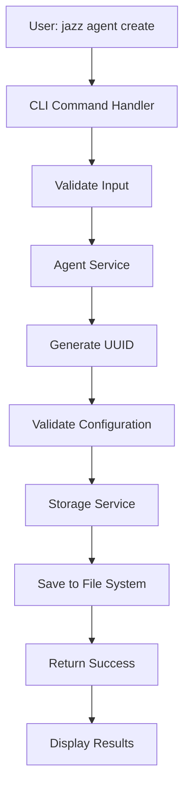
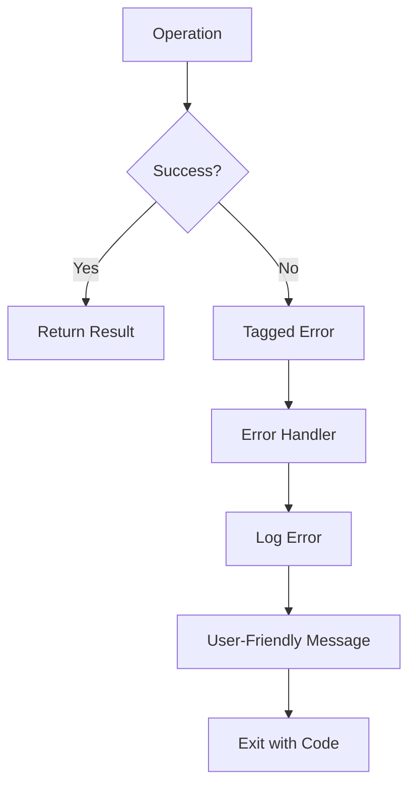

# Architecture Overview

This document provides a comprehensive overview of the Jazz CLI architecture, design patterns, and system components.

## 🏗️ System Architecture

Jazz follows a layered architecture pattern with clear separation of concerns, built on functional programming principles using Effect-TS.

```
┌─────────────────────────────────────────────────────────────┐
│                    CLI Layer                                │
│  ┌─────────────────┐  ┌─────────────────┐  ┌─────────────┐ │
│  │   Agent Cmds    │  │ Automation Cmds │  │ Config Cmds │ │
│  └─────────────────┘  └─────────────────┘  └─────────────┘ │
├─────────────────────────────────────────────────────────────┤
│                   Core Layer                                │
│  ┌─────────────────┐  ┌─────────────────┐  ┌─────────────┐ │
│  │  Agent Service  │  │ Automation Svc  │  │ Task Engine │ │
│  └─────────────────┘  └─────────────────┘  └─────────────┘ │
├─────────────────────────────────────────────────────────────┤
│                 Services Layer                              │
│  ┌─────────────────┐  ┌─────────────────┐  ┌─────────────┐ │
│  │ Storage Service │  │ Logger Service  │  │Config Svc   │ │
│  └─────────────────┘  └─────────────────┘  └─────────────┘ │
├─────────────────────────────────────────────────────────────┤
│                Effect-TS Runtime                            │
│  ┌─────────────────┐  ┌─────────────────┐  ┌─────────────┐ │
│  │   Effect.gen    │  │   Context API   │  │   Layers    │ │
│  └─────────────────┘  └─────────────────┘  └─────────────┘ │
└─────────────────────────────────────────────────────────────┘
```

## 🧩 Core Components

### 1. CLI Layer

The CLI layer provides the user interface and command parsing functionality.

**Key Components:**

- **Command Handlers**: Process user commands and delegate to services
- **Input Validation**: Validate command-line arguments and options
- **Output Formatting**: Format results for user consumption
- **Error Handling**: Present user-friendly error messages

**Example Structure:**

```typescript
// src/cli/commands/agent.ts
export function createAgentCommand(
  name: string,
  description: string,
  options: AgentOptions,
): Effect.Effect<void, AgentError, AgentService>;
```

### 2. Core Layer

The core layer contains the business logic and domain services.

#### Agent Service

Manages the complete lifecycle of agents:

- **Creation**: Validate and create new agents
- **Retrieval**: Get agent details and list agents
- **Updates**: Modify agent configuration
- **Deletion**: Remove agents and cleanup resources

#### Task Engine (Planned)

Will handle task execution and orchestration:

- **Task Types**: Command, script, API, file operations
- **Dependency Resolution**: Manage task dependencies
- **Execution Context**: Provide isolated execution environments
- **Result Collection**: Aggregate and store execution results

#### Automation Service (Planned)

Will manage automation workflows:

- **Trigger Management**: Handle various trigger types
- **Schedule Management**: Cron and interval-based scheduling
- **Workflow Orchestration**: Coordinate multiple agents

### 3. Services Layer

Infrastructure services that provide cross-cutting concerns.

#### Storage Service

Handles data persistence with multiple backends:

**File Storage Implementation:**

```typescript
export class FileStorageService implements StorageService {
  private getAgentPath(id: string): string {
    return `${this.basePath}/agents/${id}.json`;
  }

  saveAgent(agent: Agent): Effect.Effect<void, StorageError> {
    return Effect.gen(
      function* (this: FileStorageService) {
        const dir = this.getAgentsDir();
        yield* this.ensureDirectoryExists(dir);
        const path = this.getAgentPath(agent.id);
        yield* this.writeJsonFile(path, agent);
      }.bind(this),
    );
  }
}
```

**In-Memory Storage Implementation:**

- Used for testing and development
- Provides fast access with no persistence
- Implements the same interface as file storage

#### Logger Service

Structured logging using Effect's built-in Logger:

```typescript
export interface LoggerService {
  readonly debug: (
    message: string,
    meta?: Record<string, unknown>,
  ) => Effect.Effect<void>;
  readonly info: (
    message: string,
    meta?: Record<string, unknown>,
  ) => Effect.Effect<void>;
  readonly warn: (
    message: string,
    meta?: Record<string, unknown>,
  ) => Effect.Effect<void>;
  readonly error: (
    message: string,
    meta?: Record<string, unknown>,
  ) => Effect.Effect<void>;
}
```

#### Configuration Service

Manages application configuration:

- Environment-based configuration
- Default value management
- Configuration validation

### 4. Effect-TS Runtime

The foundation layer providing functional programming primitives.

**Key Patterns:**

- **Effect.gen**: Async workflow composition (replaces async/await)
- **Context API**: Dependency injection and service location
- **Layers**: Service composition and lifecycle management
- **Tagged Errors**: Type-safe error handling

## 🔄 Data Flow

### Agent Creation Flow



### Error Handling Flow



## 🎯 Design Patterns

### 1. Dependency Injection with Context

Services are provided through Effect's Context API:

```typescript
export const AgentService = Context.GenericTag<AgentService>("AgentService");

export function createAgentServiceLayer(): Layer.Layer<
  AgentService,
  never,
  StorageService
> {
  return Layer.effect(
    AgentService,
    Effect.gen(function* () {
      const storage = yield* StorageService;
      return new DefaultAgentService(storage);
    }),
  );
}
```

### 2. Tagged Errors

All errors are represented as tagged unions for type safety:

```typescript
export class StorageError extends Data.TaggedError("StorageError")<{
  readonly operation: string;
  readonly path: string;
  readonly reason: string;
}> {}

export class AgentNotFoundError extends Data.TaggedError("AgentNotFoundError")<{
  readonly agentId: string;
}> {}
```

### 3. Functional Composition

Operations are composed using Effect combinators:

```typescript
function createAgent(
  name: string,
  description: string,
): Effect.Effect<Agent, AgentError, AgentService> {
  return Effect.gen(function* () {
    const agentService = yield* AgentService;
    return yield* agentService.createAgent(name, description);
  });
}
```

### 4. Layer Composition

Services are composed using Effect Layers:

```typescript
function createAppLayer(config: AppConfig) {
  const baseLayer = Layer.mergeAll(
    createConfigLayer(),
    createLoggerLayer(config),
    NodeFileSystem.layer,
  );

  const storageLayer = createFileStorageLayer(
    config.storage.path || "./.jazz",
  ).pipe(Layer.provide(baseLayer));

  return Layer.mergeAll(
    baseLayer,
    storageLayer,
    createAgentServiceLayer(),
  ).pipe(Layer.provide(Layer.mergeAll(baseLayer, storageLayer)));
}
```

## 🔧 Configuration Management

### Application Configuration

The application uses a hierarchical configuration system:

```typescript
export interface AppConfig {
  readonly storage: StorageConfig;
  readonly logging: LoggingConfig;
  readonly security: SecurityConfig;
  readonly performance: PerformanceConfig;
}
```

### Environment Variables

Configuration can be overridden via environment variables:

- `JAZZ_STORAGE_PATH`: Storage directory path
- `JAZZ_LOG_LEVEL`: Logging level (debug, info, warn, error)
- `JAZZ_LOG_FORMAT`: Log format (json, pretty)

## 🚀 Performance Considerations

### Concurrency Control

The system includes performance limits to prevent resource exhaustion:

```typescript
export interface PerformanceConfig {
  readonly maxConcurrentAgents: number; // Default: 5
  readonly maxConcurrentTasks: number; // Default: 10
  readonly timeout: number; // Default: 30000ms
  readonly memoryLimit?: number;
}
```

### Resource Management

- **File Handles**: Proper cleanup of file operations
- **Memory Usage**: Efficient data structures and garbage collection
- **Process Isolation**: Task execution in isolated contexts

## 🔒 Security Considerations

### Input Validation

All user inputs are validated using Schema:

```typescript
export const AgentSchema = Schema.Struct({
  id: Schema.String,
  name: Schema.String,
  description: Schema.String,
  // ... other fields
});
```

### File System Security

- Path traversal protection
- Permission validation
- Secure file operations

### Credential Management

- Environment variable injection
- Secure credential storage (planned)
- Access control (planned)

## 📊 Monitoring and Observability

### Structured Logging

All operations are logged with structured data:

```typescript
yield *
  logger.info("Agent created", {
    agentId: agent.id,
    agentName: agent.name,
    timestamp: new Date().toISOString(),
  });
```

### Metrics Collection (Planned)

- Execution duration tracking
- Success/failure rates
- Resource usage monitoring
- Performance metrics

## 🔮 Future Architecture Considerations

### Plugin System

A plugin architecture is planned to support:

- Custom task types
- External integrations
- Community extensions

### Distributed Execution

Future considerations for:

- Multi-node agent execution
- Load balancing
- Fault tolerance

### API Layer

Planned REST API for:

- Remote agent management
- Web-based dashboard
- Integration with external systems

## 📚 Related Documentation

- [CLI Reference](cli-reference.md) - Command documentation
- [API Reference](api-reference.md) - Service interfaces
- [Configuration](configuration.md) - Configuration options
- [Examples](examples.md) - Usage examples
